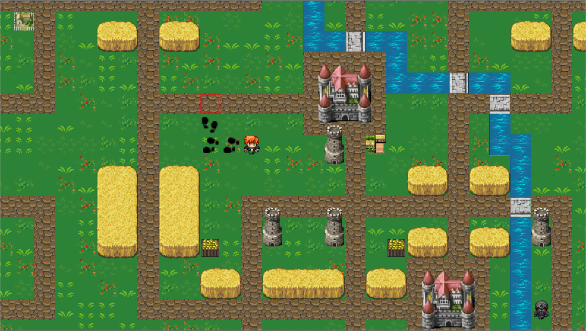

## DungeonCountry

### Frameworks / Libraries
* Unity
* SQL

### Description

A game based off the classic Heroes of Might and Magic franchise.

### Development

Development currently at 60% to Beta.

### Install

1. Clone repository and open in Unity

### Screens

#### license

MIT. Copyright (c) Brad Zimmerman
